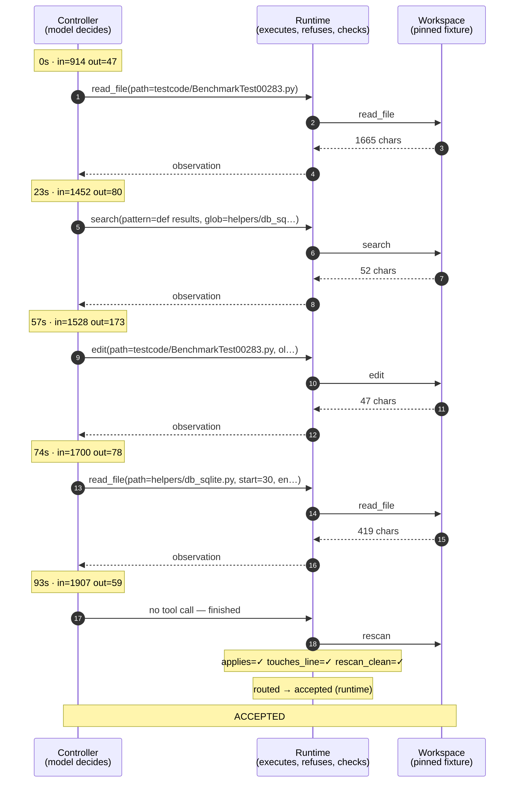

```mermaid
sequenceDiagram
    autonumber
    participant C as Controller<br/>(model decides)
    participant R as Runtime<br/>(executes, refuses, checks)
    participant W as Workspace<br/>(pinned fixture)

    Note over C: 0s · in=914 out=47
    C->>R: read_file(path=testcode/BenchmarkTest00283.py)
    R->>W: read_file
    W-->>R: 1665 chars
    R-->>C: observation
    Note over C: 23s · in=1452 out=80
    C->>R: search(pattern=def results, glob=helpers/db_sq…)
    R->>W: search
    W-->>R: 52 chars
    R-->>C: observation
    Note over C: 57s · in=1528 out=173
    C->>R: edit(path=testcode/BenchmarkTest00283.py, ol…)
    R->>W: edit
    W-->>R: 47 chars
    R-->>C: observation
    Note over C: 74s · in=1700 out=78
    C->>R: read_file(path=helpers/db_sqlite.py, start=30, en…)
    R->>W: read_file
    W-->>R: 419 chars
    R-->>C: observation
    Note over C: 93s · in=1907 out=59
    C->>R: no tool call — finished
    R->>W: rescan
    Note over R: applies=✓ touches_line=✓ rescan_clean=✓
    Note over R: routed → accepted (runtime)
    Note over C,W: ACCEPTED
```