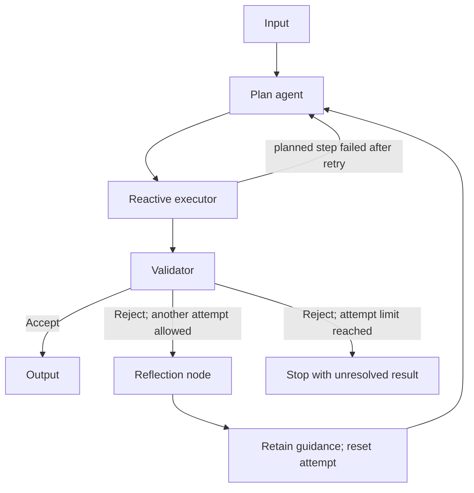

# Week 2 / Unit 1 — Lecture 2 plan (Part A)

**Course:** COMS E6998-019 — Design of Production Agentic Systems  
**Meeting:** September 18, 2026  
**Block:** First 50-minute lecture (Part A), followed by a 10-minute break, then Part B  
**Status:** Agreed teaching structure, revised September 15; demo preparation remains to be done.

“Lecture 1” here means the first teaching block of the Week 2 meeting (Part A). The second block (Block B) will be planned separately. This document records the agreed scope for the slides, detailed lecture notes, and instructor demo.

**Revision of September 15.** Three changes from the previous version: a fixed-workflow version (V0) with Agentless as the published reference; in-run plan revision in V2, triggered by a scripted tool fault; and an explicit note that V1 only *flashes* the execution machinery (state schema, tool signatures, dispatch, routing, terminal states), which Part B then explores conceptually. Timing was rebalanced to fit 50 minutes with a 10-minute break.

## 1. Organizing idea

Ground the class in AIMA Chapter 2, then build up one serial agent, `mini-swe-agent`, through five runnable versions:

0. A fixed workflow: a four-node chain in which the programmer made every control decision, with Agentless (FSE 2025) as the published reference.
1. A baseline reactive/ReAct agent with tracing and trajectory analysis.
2. An LLM planning node before that agent, with in-run plan revision when a planned step fails.
3. A validator after its candidate patch.
4. A reflection node on rejection, retaining guidance and looping back to a fresh planning-and-execution attempt.

Close with other architectures from Google's agentic design-pattern guide, then take the break. Agent design is the subject. The demo task is **patch generation**: each scanner alert is read as an issue report, and the agent produces a patch that removes the reported weakness. HW1 is alert *triage* (a verdict with evidence), so the published V0–V4 scaffold the architecture without handing over HW1's job. Vulnerability analysis is not discussed as a domain until Block B, after HW1 has been introduced.

The progression is one axis, asked at every version: **which decisions did the programmer make at design time, and which are deferred to the model at run time?** V0 defers none. V1 defers the choice of the next action. V2 defers the plan and, when a planned step fails, its revision. V3 hands acceptance to an evaluator. V4 hands “try again?” to the runtime.

**Every section is content-first:** introduce the paper or book grounding, explain the theory and the problem the mechanism addresses, and only then show the corresponding demo code and, where useful, its trajectory.

Use this teaching order consistently:

1. **Reading and motivation:** what problem is the paper or book addressing, and why does the mechanism matter?
2. **Theory and mechanism:** what are the components, assumptions, state, and control flow? What does the evidence establish?
3. **Demo code:** show how that mechanism is represented in the prepared agent.
4. **Execution or trajectory:** use a selected run to make the mechanism visible.

The demo versions are prepared before class. Preserve each version: its source, graph, state, and traces are published to students after class as scaffolding for HW1 (see §11). The implementation illustrates concepts that have already been introduced.

## 2. Timing

| Time | Duration | Segment | Concrete classroom activity |
| --- | ---: | --- | --- |
| 0–7 | 7 min | AIMA Chapter 2 grounding | About 5 min of theory, then 2 min mapping those concepts onto the example agent. |
| 7–11 | 4 min | V0: fixed workflow (Agentless) | About 2 min on Agentless and what “fixed” means; then 2 min showing the four-node chain and its trace beside V1's loop. |
| 11–20 | 9 min | V1: reactive/ReAct baseline | About 4 min on the ReAct paper, motivation, and mechanism; then 5 min introducing the task and showing code plus a selected trace, including a one-minute flash of the execution machinery. |
| 20–28 | 8 min | V2: add a planner, with in-run revision | About 3 min on planning theory and AdaPlanner; then 5 min showing the planning node, the generated plan, the scripted tool fault, the runtime retry, and the revised plan. |
| 28–34 | 6 min | V3: add a validator | About 3 min on feedback, evaluation, and reliability; then 3 min showing validator code and a selected candidate/decision. |
| 34–43 | 9 min | V4: add Reflexion | About 4 min on the Reflexion paper and across-attempt memory; then 5 min on reflection/reset code and a selected two-attempt execution. |
| 43–50 | 7 min | Other agent design patterns | About 4 min introducing patterns and tradeoffs from Google's guide; then 3 min relating their diagrams to the concrete serial agent. |
| 50–60 | 10 min | Break | End Part A here. |

For a 45-minute block, use 6 / 4 / 8 / 7 / 5 / 8 / 7 minutes respectively. This preserves the opening theory, the fixed-workflow baseline, and the closing pattern discussion.

The short segments introduce selected paper mechanisms and figures before each implementation. Detailed experimental discussion and supporting explanations belong in the accompanying notes and reading selections. In the 45-minute variant, shorten code inspection and trace playback first while retaining the content-first sequence.

## 3. Opening theory: AIMA Chapter 2

Interpret “§2 of AIMA” as **Chapter 2, Intelligent Agents**, in Russell and Norvig, *Artificial Intelligence: A Modern Approach*, fourth edition. The official [table of contents][aima] identifies the following sections (pp. 36–63); students use their book or library copy for the text.

### Content first: theory from the book (about 5 minutes)

| Approximate time | Reading | Teaching purpose |
| --- | --- | --- |
| 1 min | §2.1, Agents and Environments | Introduce percepts/observations, actions, and the agent–environment interaction. |
| 1 min | §2.2, Good Behavior: The Concept of Rationality | Separate a performance measure from a desired answer; relate decisions to available evidence and resource constraints. |
| 1 min | §2.3, The Nature of Environments | Specify the task environment (§2.3.1) and its properties (§2.3.2); explain incomplete information. |
| — | §2.4, The Structure of Agents | **Deferred to §10** (decided September 16): the agent-program taxonomy is discussed at the end of the block, once V0–V4, ReAct, Reflexion, and Google's patterns exist to place on it. The opening keeps §2.1–2.3 and §2.4.7 (state representations). |

Lecture 1 used Poole and Mackworth's vocabulary (controller, body, belief state). The detailed notes carry a one-row-per-term translation to AIMA's agent program, percept, and internal state, so the same concept is not taught under two names.

### Then the concrete agent: map the theory (about 2 minutes)

Use a compact task mapping on the board and point to the corresponding parts of the demo:

- **Performance:** the weakness the alert reports is gone and the endpoint still returns what it returned before, with bounded execution cost.
- **Environment:** OWASP BenchmarkPython at the pinned commit, one scanner alert read as an issue report, and the working tree the agent edits.
- **Observations:** the alert, file excerpts, search hits, edit confirmations, the validation result, and tool errors.
- **Actions:** read, search, edit, and submit a patch.
- **Working state:** locations found, excerpts read, edits applied, cost spent, and the current status.
- **Controller:** proposes the next action or the patch.
- **Runtime:** executes permitted actions, applies edits and state updates, routes control, and enforces stopping rules.

Explain that the working tree changes only through the agent's `edit` action; everything else that changes during a run is the agent's information, not the environment.

Terminology to keep precise: ReAct is not synonymous with AIMA's simple reflex agent; an LLM agent can use history, goals, and plans. “Model-based” in AIMA refers to an environment model, rather than merely the presence of an LLM.

## 4. Shared example and implementation foundation

### The demo agent: `mini-swe-agent`

The lecture's running agent is `mini-swe-agent`. It reads one scanner alert as an issue report, localizes the code the alert names, edits it, and submits a patch; the run ends when the submission is accepted. Three states and five transitions: **Controller** decides the next action, **Tool** executes it and returns an observation (one node per tool: `read_file`, `search`, `edit`), and **Submit** validates the submission, ending the run on *accepted* and returning feedback to the controller on *rejected*. V0–V4 are changes to that machine: a state, an edge, or a different component deciding. The notes carry the state machine as `notes/figures/agent-state-graph.tikz` and one worked run as `notes/figures/seq-mini-swe-agent.tikz`.

The agent is scoped to patching, not triage, so nothing in the published versions hands over HW1's intake, alert contract, verdict, or evidence rules.

### Worked alert

Use OWASP BenchmarkPython at commit `f1291485808b66e20ddb6b01b10dc71b3df8c8ba` (verified September 15: 2,540 files, 1,230 test cases).

- Alert: Bandit `B608`, string-based SQL query construction, at [`testcode/BenchmarkTest00283.py`][case283] line 46. Line 46 interpolates `bar` into the query with an f-string; line 49 runs `cur.execute(sql)`.
- Patch: two lines in one file. Line 46 becomes `sql = 'SELECT username from USERS where password = ?'` and line 49 becomes `cur.execute(sql, (bar,))`. Confirmed against the pinned source on September 16.
- Why this alert: the fix is two lines, so the trace is short enough for a slide, and the value it interpolates comes from [`helpers/separate_request.py`][request-helper] through `get_form_parameter()`, so a second, harder variant exists for the depth-of-investigation discussion.

**Acceptance, and the gap it leaves.** The Submit state can check that the patch applies, that it touches the flagged line, and that a rescan no longer reports the alert. It cannot check that the endpoint still returns what it returned before. Say that gap out loud in V0 and hold it: it is what V3's validator and Week 4's verification material are for.

Keep benchmark answer labels outside the agent's searchable source: strip `expectedresults-0.1.csv`, `results/BenchmarkPython-Bandit.sarif`, and `results/Benchmark-Bearer-v1.51.1.json` from the copy handed to the agent and to students. Generate fresh alerts for the pinned fixture; the bundled Bandit report does not contain the selected case IDs.

### Shared components

- An intake stage (run the pinned scanner over the fixture → one alert contract → alert queue) and a report stage (patches, cost, terminal status), shared by all versions.
- An explicit LangGraph `StateGraph` with sequential execution.
- Three tools: `read_file`, `search`, and `edit` (a replacement the runtime applies to the working tree).
- A scripted fault hook in `read_file`, off by default, keyed to a named run (used by V2).
- A task record: repository, pinned commit, and the alert (rule, file, line, message).
- A structured candidate patch: the diff against the pinned commit, and the checks the Submit state ran.
- Trace events for model calls, tool arguments/results, state changes, and stopping reasons. Reuse Lecture 1's trace conventions: the terminal status is stated with every run, and token usage is four separate counters that are never summed.
- A readable trajectory view for instructor explanation and student review.

The trace records observable execution. It does not require access to private model reasoning. Tracing runs throughout execution; trajectory analysis is the subsequent inspection of those events.

## 5. V0 — Fixed workflow

### Content first: Agentless, and what “fixed” means

**Paper:** [Xia, Deng, Dunn, and Zhang, *Demystifying LLM-Based Software Engineering Agents*, FSE 2025][agentless] (the “Agentless” title prefix exists only on the arXiv preprint). Assign and page from the FSE camera-ready: Section 1; Section 3.1, Localization (3.1.1–3.1.3); Section 3.2, Repair; and Figure 1. The arXiv v1 numbers the approach as Section 2 with two phases; the camera-ready has three phases in Section 3, so a student reading from the arXiv link reads the wrong sections.

Begin with the definition: in a fixed workflow the programmer made every control decision at design time. The model fills in content — which files look suspicious, what the patch should say — but never selects the next operation and never decides when to stop; the runtime's phase boundary is the terminal condition. Agentless is the cleanest published instance on our own kind of chassis, a source repository: localization, then repair, then patch validation, each phase a fixed sequence of model calls with programmer-defined inputs and outputs.

State the tradeoffs on the syllabus's three axes. Adaptability: none beyond what the phases anticipate; a task that does not fit the phases fails in a predictable place. Model calls: a known number per task, decided before the run. Debugging: every intermediate artifact has a fixed name and position, so a failure is located by phase. Then the caveat the authors make themselves: the case rests on SWE-bench Lite, where issues are narrow and well specified; it does not show that fixed workflows win in general. Any solve-rate or cost figure shown on a slide is read off the FSE camera-ready's tables, not the preprint.

### Then the demo: a four-node chain

```text
Input → localize the file (model, from the alert and the repository skeleton) → localize the lines (model, from the file) → generate the patch (model) → validate the submission (runtime) → output
```

Four nodes, no routing predicate other than “next”, no edge back: Agentless's three phases as a chain. The programmer decided the depth of investigation — one file, one region, one patch — and the model is called a fixed number of times with programmer-defined inputs. There is no edge back, so the chain cannot follow a value into a helper. Show the graph beside V1's loop so the difference is visible.

Point out what the chain cannot do: if the fix needs a second file, or the value the query interpolates comes from a helper the alert does not name, nobody can go and get it; if the localized region is wrong, the patch is wrong in a predictable place. A fixed workflow cannot ask a second question. That limitation motivates V1, and it is why HW1's investigation loop is reactive — while HW1's intake stage, which runs the scanners and normalizes their alerts, is exactly this kind of fixed chain.

V0 is cheap once V1's tools exist, and its trace is the baseline the later versions are compared against. Build and preserve it like the others. If preparation time runs out, show the static graph beside Agentless Figure 1 and defer the trace.

## 6. V1 — Baseline reactive/ReAct agent

### Content first: paper, theory, and purpose

**Paper:** [ReAct, ICLR 2023][react], §2 and Figure 1 for the mechanism; §3.3/Table 2 for repetitive actions and unhelpful retrieval.

Begin with the investigation problem: information needed for a decision may only become available after an action. Explain how interleaving reasoning, actions, and observations lets the agent use newly obtained evidence to choose its next step. Identify the model's decision, the runtime's execution, and the resulting observation. Explain why interaction can provide useful evidence while still permitting poor action choices.

Contrast with V0 in one sentence: the graph now has an edge back, and the model chooses which edge to take. Fixed workflows need no further conceptual reference here; V0 has already made the programmer-defined versus model-selected distinction concrete.

For the notes (optional citation): [EnIGMA, ICML 2025][enigma], §4.2, reports “soliloquizing” — the model emitting thought, action, and a fabricated observation in one response without touching the environment. It is the sharpest evidence that the runtime, not the model, must own the observation channel.

### Then the demo: code and selected trajectory

**Behavior:** the model examines available evidence, requests a tool, receives its observation, and chooses again.

```text
Input → model decision → tool execution → observation/state update
                ↑                                  |
                └──────────────────────────────────┘

Model submits a patch → Submit validates it → accepted ends the run
```

Show the task instructions, tool signatures, model-decision node, tool dispatcher, and continuation/termination routing. Explain what the programmer defines and what the model chooses during a run.

**Flash the execution machinery, do not teach it here.** In about one minute, put five things on screen in one pass and name them: the state schema (a typed record with reducers), the three tool signatures, the dispatcher (request → validate → execute → observation → state update), the routing predicate (continue or submit), and the terminal statuses the trace can record. Say that Part B takes each of these up conceptually after the break; in this block they are only pointed at so the later versions can be read.

Inspect a prepared trajectory to locate the observation that motivates another action. If the model follows `get_form_parameter` into `helpers/separate_request.py`, show the actual request and returned source. End the segment with the debugging question that recurs for every version: what does this trace let you see that the previous version's could not?

## 7. V2 — Add the planner, and revise the plan in-run

### Content first: planning theory and the paper

**Readings:** AIMA §11.1 and §11.5.3 provide planning vocabulary; §11.5.3, *Online planning*, is the section on execution monitoring and replanning. [AdaPlanner, NeurIPS 2023][adaplanner], §§3.1–3.2 and Figure 2 provide a research comparison for explicit planning with feedback: the plan is refined when environment feedback contradicts it. Figure 4(a) belongs in the detailed notes as experimental evidence about closed-loop corrections.

Explain why an agent might externalize its goals and subgoals: a plan makes intended work, dependencies, and progress inspectable. Distinguish four things: generating a plan, executing it, tracking progress, and revising it in response to changed assumptions. Then separate the two events that can change a plan, because the syllabus promises “when plans change” and students otherwise conflate them:

- **In-run revision.** A planned step turns out to be impossible, or its assumption false, and the remaining plan is revised inside the same attempt. This is AdaPlanner's refinement on feedback, and it is what V2 demonstrates.
- **Between-attempt revision.** A whole attempt is rejected and a new plan is made with retained guidance. That is V4.

Discuss the additional planning calls and the possibility that a simple task gains little from them. Compare committing to a plan (fewer calls, inspectable intent, brittle to surprises) with choosing one action at a time (adaptive, more calls, harder to audit). The classroom graph is a teaching adaptation, rather than a reproduction of AdaPlanner's full system.

### Then the demo: planning node, stored plan, and a scripted fault

```text
Input → plan agent → reactive executor → output
             ↑              |
             └── planned step failed after retry ──┘
```

The planning node invokes an LLM to propose structured investigation subgoals. The instructor implements its instructions, output structure, and integration with the executor. The model supplies the actual plan.

Store the plan in state and provide it to the executor. Show the generated subgoals and the evidence or completion conditions they call for. The executor still selects concrete tool actions.

**The fault is scripted, not random.** In the designated demo run, `read_file` fails on its first call for `testcode/BenchmarkTest00283.py` with a tool error. The fault is a named hook in the tool, keyed to the run, so the trace replays identically every time; a random fault would make the trace unreproducible, which is what Lecture 1 told students not to accept. Two things then happen, and they are decided by different components:

1. **The runtime retries once.** No model call. This is a runtime policy about transient failure. Say that retry policy proper — backoff, caps, idempotency — is Week 11, and that one retry is here only so the two levels of authority are visible.
2. **The second failure fires a routing predicate** — the planned step has failed and retries are exhausted — which routes back to the planner with the failed subgoal and the tool error in state. The planner revises the remainder of the plan (for example: establish the query text from the `search` hit's context rather than by reading the file, or edit from the search hit's line). Execution continues under the revised plan.

Show, in order: the original plan; the tool-error observation; the retry (runtime); the second error; the revised plan; the step that completes it. Label each with who decided, runtime or model, and what state changed. For the small fixture, following a helper may simply complete an existing subgoal; do not describe ordinary progress as replanning. Replanning is the event above and nothing else.

## 8. V3 — Add the validator

### Content first: feedback, evaluation, and reliability

**Readings:** [Self-Refine, NeurIPS 2023][self-refine], §2/Figure 1, for feedback and revision; [Reflexion, NeurIPS 2023][reflexion], §3/Figure 2, for actor–evaluator separation.

This is the syllabus's evaluator–optimizer pattern, and Lecture 1 §6.5's claim in executable form: the entity that proposes is not the entity that judges, and reflection is a control-flow decision rather than a prompt.

Explain why generating a candidate and assessing it are separate responsibilities. Identify what the evaluator can observe, the criterion it applies, and how its decision controls acceptance. Distinguish mechanical checks, such as a patch that applies cleanly, an edit that touches the flagged line, and a rescan that no longer reports the alert, from a model's semantic assessment of whether the patch removes the weakness without changing behavior. A clean rescan does not establish a correct fix, and a model-based evaluator is fallible. For the notes, the peer-reviewed counterweight is [Huang et al., ICLR 2024][huang] and [Stechly et al., ICLR 2025][stechly]: a loop terminated by the model's own judgement can cost more calls and lose accuracy, while a loop terminated by an independent signal is a different object. The mechanical checks are the independent signal available here.

Relate feedback to possible revision, then explain this implementation's staged progression: V3 reports a decision; V4 adds the outer retry mechanism.

### Then the demo: validator code and a selected finding

```text
Input → plan agent → reactive executor → validator → result
```

The executor now produces a **candidate** patch. The validator receives the alert, the candidate patch, the Submit state's mechanical checks, and the trajectory, and returns an acceptance decision with specific reasons.

- On acceptance, release the patch.
- On rejection, record the unsuccessful outcome and feedback. V4 adds the recovery path.

### Preparation: selecting the failure

Use either an actual unsuccessful run from a model that struggles on the selected task or a suitable existing instructor trajectory. Inspect the trace first and identify a specific wrong hunk, an edit that silences the scanner without removing the weakness, a claimed check that did not happen, or another task failure. A cheaper or smaller model is a candidate to test, not a guarantee of the desired behavior.

If an existing trajectory belongs to another task or repository, preserve that context when replaying it. Clearly identify recorded executions as replays. The baseline can also succeed, in which case validation should accept it.

Reuse the selected unsuccessful attempt as the starting point for V4.

## 9. V4 — Add Reflexion and the outer attempt loop

### Content first: the paper and across-attempt memory

**Paper:** [Reflexion, NeurIPS 2023][reflexion], §3/Figure 2 is the primary mechanism reference. The notes should include §4.3/Table 3 to explain the contribution and limitations of feedback and reflection.

Introduce the actor, evaluator, reflection process, and retained memory. Explain why another attempt might benefit from a diagnosis of the previous attempt, and distinguish retained guidance from simply continuing an existing conversation. Retained text changes the context for a later attempt; model weights remain fixed. Explain that the usefulness of reflection depends on the failure assessment and the guidance it produces.

Define the attempt boundary and what is retained or reset before opening the implementation.

### Then the demo: reflection node, reset, and another attempt

This is the agreed complete serial graph:



The planner and reactive executor collectively play the actor role in the paper's formulation. The validator plays the evaluator role. The reflection node interprets a failed attempt and produces guidance that the next attempt can use. The planner now has two triggers, and they should be named apart: in-run revision from a failed step (V2), and a fresh plan after a rejected attempt with retained guidance (this version).

Say the syllabus's sentence out loud here: **dynamic paths need not change the graph definition.** This graph is fixed. Accept, reject-and-retry, and reject-and-stop are chosen at run time by predicates over state.

| Component | Input | Output |
| --- | --- | --- |
| Validator | Alert, candidate patch, mechanical checks, trajectory | Accept/reject with specific reasons. |
| Reflection node | Task, failed trajectory, validator feedback | A short diagnosis and actionable guidance. |
| Next planner invocation | Original task and retained guidance | A new investigation plan. |
| Next executor invocation | Task, new plan, retained guidance | A fresh source investigation. |

These roles can use the same underlying LLM with different instructions. Their separation is visible in the graph and in the information each receives.

### What carries into another attempt

| Retain | Reset |
| --- | --- |
| Original task and repository identity | Working plan and progress |
| Accumulated reflection guidance | Current tool observations and edits (the working tree is reset to the pinned commit) |
| Attempt counter and overall usage accounting | Candidate patch and validation result |
| Archived traces for review | Current attempt's conversation history |

Store archived traces separately from the next actor's active conversation. Give both the new planner invocation and executor the retained guidance. For this teaching version, the next actor receives that guidance rather than the entire previous conversation.

Use a maximum of two attempts and an overall execution limit that includes planning, execution, validation, and reflection calls. Resetting an attempt does not reset total usage. Stop when the validator accepts or another attempt is not permitted; report an unresolved result when acceptance has not been obtained. The runtime checks the overall limit before making another model call, including a reflection call.

Demonstrate the selected rejected attempt, the reflection actually generated from it, the changed input to the planner, and the next execution. Preserve an unsuccessful second attempt if that is what occurs. Close on the debugging question again: with the validator's reasons and the reflection text in the trace, what can now be seen that V1's trace could not show?

## 10. Closing: other agent design patterns

### Content first: patterns and their purposes

Use [Google Cloud: Choose a design pattern for your agentic AI system][google-patterns], particularly the requirements, pattern diagrams, and comparison sections.

Spend the first part of this 7-minute section introducing a small selection:

| Pattern | Focus of discussion |
| --- | --- |
| Coordinator / specialist routing | Who selects the worker, what context is passed, and who owns the returned result? |
| Hierarchical task decomposition | How are subgoals assigned, and how are partial results integrated? |
| Parallel work | Which tasks are independent, and what does their eventual join require? |
| Review/critique and iterative refinement | Where does feedback route control, and what causes the system to stop? |

### Then the concrete example: relate patterns to the demo agent

Open with AIMA §2.4's taxonomy (simple reflex, model-based reflex, goal-based, utility-based, learning agent), deferred here from the opening: place ReAct (model-based; the trajectory is the state), Reflexion (the learning agent's structure: actor, critic, reflection as the learning element that changes context rather than weights), the guide's pattern families (deterministic workflows versus model-chosen routing; review and refinement as critic plus attempt loop), and V0–V4 on it. The notes carry this as `notes/sections/deferred/structure-of-agents.tex` for Section 7.

Return to the serial system's graph and identify how each selected pattern would change task ownership, state boundaries, model-call overhead, latency, failure propagation, or inspectability. Google's guide is supplementary engineering reading; the academic papers and AIMA provide the principal study material.

If time allows, end with a two-minute prompt to the room: given forty alerts, a fixed per-alert budget, and a rule that every submitted patch has been checked, which of V0–V4 would you deploy, and which of the four axes — adaptability, model-call overhead, failure propagation, inspectability — decides it? That is the shape of a midterm question.

This closing segment surveys alternatives. The executable progression for this first block ends with the serial Reflexion loop.

**End Part A and take the 10-minute break.**

## 11. Preparation and notes

### Instructor preparation

1. Pin the fixture and generate the alerts named in §4; strip the answer key and bundled scan results.
2. Confirm the three tools work in the checked-out tree, and that the rescan used by the Submit state runs and is reproducible.
3. Implement and preserve V0–V4, including their visible state and trace output, using Lecture 1's trace conventions.
4. Implement the scripted fault hook in `read_file` and confirm the V2 run replays identically: plan, fault, retry, second fault, revised plan.
5. Select a real unsuccessful run or an existing instructor trajectory suitable for validation and reflection.
6. Prepare the corresponding validator decision and reflection execution, with recorded fallback traces.
7. Prepare the AIMA grounding slides (no Poole–Mackworth material), paper figures, incremental graph/code views, and selected Google pattern diagrams.
8. Rehearse the 50-minute sequence and prepare the 45-minute timing variant.

### Verify before it reaches a slide

Per Lecture 1's first rule, every figure, table, and section number is checked against the version cited:

- Agentless: section numbers and any solve-rate or cost figures, from the FSE camera-ready (DOI), not arXiv v1.
- ReAct §3.3/Table 2: confirmed against the ICLR version.
- AdaPlanner §§3.1–3.2, Figure 2, Figure 4(a), and the refinement terminology used on the slide: confirm against the NeurIPS proceedings PDF.
- Reflexion §4.3/Table 3: confirm the table number in the NeurIPS proceedings PDF; cite five authors (the camera-ready byline).
- AIMA §2.1–2.4 and §11.1/§11.5.3: section titles and pages confirmed against the publisher's contents (September 15).

### Detailed lecture notes

For each mechanism, use the same content-first order as the lecture: paper/book grounding, motivation and theory, then demo graph/code/state, followed by an annotated execution where useful. Give the paper figures and experiments sufficient context for independent exam study. The notes should make clear which statements describe the published systems and which describe this adapted teaching demo.

The removed three-execution comparison experiment is not part of this plan. Tracing and trajectory analysis remain part of the baseline and its extensions.

### Boundary with the second block

Plan Part B next. Part A owns the architectures; Part B owns the execution machinery that V1 only flashed, taken up conceptually: the state schema and reducers, transitions and conditional routing as predicates over state, terminal states, tool signatures and the request → dispatch → observation → state-update cycle, and execution authority (the model proposes, the runtime executes and may refuse). Part B then introduces HW1 and releases it, and only after that the vulnerability-analysis domain. HW1's week-3 token-budget material remains separate from the instructor's broader architecture demonstration.

### HW1 scope and dates (decided September 15)

HW1 is a **bounded triage application**, not a single-alert agent. (The lecture demo, `mini-swe-agent`, *patches* alerts on the same fixture; HW1 *judges* them and must produce a verdict with evidence, so nothing in V0–V4 hands over HW1's intake, alert contract, or evidence rules.) Released September 18; **due Friday October 9, before class**. HW2 is released October 2, so the two overlap by one week. Sequential, one process:

1. **Intake** — run pinned Semgrep and Bandit over the stripped fixture and normalize both outputs into one alert contract (Lecture 1's five fields). A fixed, runtime-owned stage. It must accept a selector (`--alert-id` / `--location`) so a single-investigation run exists for grading.
2. **Planner** — V2-style, advisory, stored in state. Required; in-run revision optional.
3. **Investigation loop** — the reactive loop over `read_file` / `search`, one investigation per alert (V1's shape).
4. **Structured finding** — TP / FP / Other with resolvable evidence references.
5. **Report aggregation** — findings across the selected alerts.
6. **Per-investigation token budget** — admission with output allowance, reconciliation, explicit exhaustion outcome; the job proceeds to the next alert. Mechanics are taught September 25; the brief says so.

Validator and reflection are optional: adopt one and justify it with trace evidence. No MCP, CLDK, concurrency, persistence, or deployment. Experiments as before: one normal run over a small alert set (pair `get_form_parameter` TPs with `get_safe_value` FPs), and one scripted exhaustion run on a single investigation using the grading guide's fixture. Teams may adapt the published V0–V4 with attribution; the intake contract, budget policy, exhaustion outcome, and evidence resolution must be their own. Suggested pacing in the brief: intake, loop, and findings by September 25; budget by October 2; experiments and report by October 9.

Consequences for other documents: the instructor syllabus (`instructor-materials/course_structure.md`, W2/W4/W5 rows, the HW1 spec, the Homeworks table, preparation items 1–2, and grading guide §§1–2) and its Canvas mirror still describe the single-alert HW1 due October 2 and must be revised to match; the course website was updated September 15.

## Sources

### Reading split (proposed)

- **Before class (about 60 minutes):** ReAct §2 with Figure 1 and one trajectory; Reflexion §3; AIMA §2.3.2 and §2.4.1–2.4.5.
- **Notes-only, cited in lecture:** Agentless §1, §3.1–3.2, Figure 1; AdaPlanner §§3.1–3.2, Figure 2; Self-Refine §2; AIMA §11.1 and §11.5.3; the Google design-pattern guide; EnIGMA §4.2; Huang et al.; Stechly et al.
- **HW1 setup, not counted as reading:** LangGraph Graph API and *Workflows and agents*.

The course website currently lists ReAct §2, LangGraph *Workflows and agents*, and Reflexion §3 for Week 2. Post the revision with a dated line: nothing is removed, AIMA is added, and LangGraph moves from reading to setup.

### Works

- **Book:** Russell and Norvig, *Artificial Intelligence: A Modern Approach*, fourth edition, Chapter 2; selected §11.1 and §11.5.3 material. [Official contents][aima].
- **Fixed-workflow paper:** Xia, Deng, Dunn, and Zhang, *Demystifying LLM-Based Software Engineering Agents*, FSE 2025, Proc. ACM Softw. Eng. 2 (FSE), 801–824. [DOI][agentless]; [author copy of the FSE version][agentless-pdf].
- **Core paper:** Yao et al., *ReAct: Synergizing Reasoning and Acting in Language Models*, ICLR 2023. [Paper][react].
- **Planning paper:** Sun et al., *AdaPlanner: Adaptive Planning from Feedback with Language Models*, NeurIPS 2023. [Paper][adaplanner].
- **Feedback paper:** Madaan et al., *Self-Refine: Iterative Refinement with Self-Feedback*, NeurIPS 2023. [Paper][self-refine].
- **Reflection paper:** Shinn et al., *Reflexion: Language Agents with Verbal Reinforcement Learning*, NeurIPS 2023. [Paper][reflexion].
- **Evaluator reliability (notes):** Huang et al., *Large Language Models Cannot Self-Correct Reasoning Yet*, ICLR 2024. [Paper][huang]. Stechly, Valmeekam, and Kambhampati, *On the Self-Verification Limitations of Large Language Models on Reasoning and Planning Tasks*, ICLR 2025. [Paper][stechly].
- **Observation channel (notes):** Abramovich et al., *EnIGMA: Interactive Tools Substantially Assist LM Agents in Finding Security Vulnerabilities*, ICML 2025. [Paper][enigma].
- **Implementation reference:** LangGraph [Graph API][langgraph-api] and [Workflows and agents][langgraph-workflows].
- **Supplementary patterns:** Google Cloud [design-pattern guide][google-patterns].
- **Example source:** [OWASP BenchmarkPython][benchmark] at the pinned revision above; the worked alert is Bandit `B608` at `testcode/BenchmarkTest00283.py` line 46. SWE-bench (Jimenez et al., ICLR 2024, [paper][swebench]) is cited for the task shape, not used as the fixture.

[aima]: https://aima.cs.berkeley.edu/contents.html
[agentless]: https://doi.org/10.1145/3715754
[agentless-pdf]: https://lingming.cs.illinois.edu/publications/fse2025.pdf
[react]: https://arxiv.org/pdf/2210.03629
[adaplanner]: https://proceedings.neurips.cc/paper_files/paper/2023/file/b5c8c1c117618267944b2617add0a766-Paper-Conference.pdf
[self-refine]: https://proceedings.neurips.cc/paper_files/paper/2023/file/91edff07232fb1b55a505a9e9f6c0ff3-Paper-Conference.pdf
[reflexion]: https://proceedings.neurips.cc/paper_files/paper/2023/file/1b44b878bb782e6954cd888628510e90-Paper-Conference.pdf
[huang]: https://proceedings.iclr.cc/paper_files/paper/2024/file/8b4add8b0aa8749d80a34ca5d941c355-Paper-Conference.pdf
[stechly]: https://proceedings.iclr.cc/paper_files/paper/2025/file/f3c5e56274140e0420baa3916c529210-Paper-Conference.pdf
[enigma]: https://proceedings.mlr.press/v267/abramovich25a.html
[langgraph-api]: https://docs.langchain.com/oss/python/langgraph/graph-api
[langgraph-workflows]: https://docs.langchain.com/oss/python/langgraph/workflows-agents
[google-patterns]: https://docs.cloud.google.com/architecture/choose-design-pattern-agentic-ai-system
[swebench]: https://arxiv.org/abs/2310.06770
[benchmark]: https://github.com/OWASP-Benchmark/BenchmarkPython
[case283]: https://github.com/OWASP-Benchmark/BenchmarkPython/blob/f1291485808b66e20ddb6b01b10dc71b3df8c8ba/testcode/BenchmarkTest00283.py#L31-L49
[request-helper]: https://github.com/OWASP-Benchmark/BenchmarkPython/blob/f1291485808b66e20ddb6b01b10dc71b3df8c8ba/helpers/separate_request.py#L3-L19
