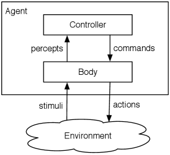
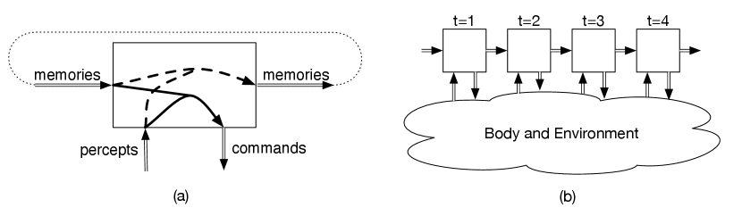
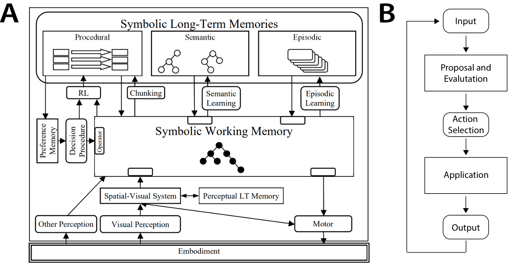
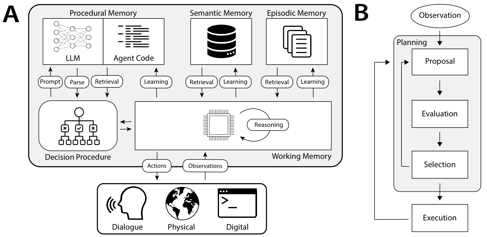
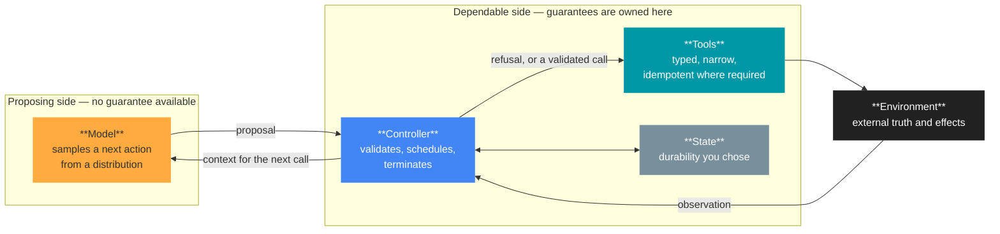

# Chapter 4 · How We Got Here

**COMS 6998-019 · Design of Production Agentic Systems · Lecture 1, §4**

These notes correspond to minutes 20–26 of Lecture 1. They are written to be read
without the slides and to be usable as a reference for the rest of the term. Two
of this week's three assigned readings are covered here: Poole & Mackworth
§§2.1–2.3, and CoALA §4.

---

## Learning objectives

After working through this chapter you should be able to:

1. Trace each part of the popular six-part anatomy of an agent back to the area of
   research and the decade it comes from.
2. Name the component roles that appear in a 2017 textbook diagram of an agent,
   state which role each corresponds to in this course's vocabulary, and say where
   the model and the caller sit relative to them.
3. Explain why the *body* being the only path to the environment is what makes a
   system analysable, and what is lost when that property does not hold.
4. Distinguish **context** from **state** operationally, and apply the process-kill
   test to any piece of information in a running system.
5. Recognise the two unrelated meanings of the phrase *production system* and use
   each correctly.
6. State precisely what changed with the arrival of language models, in terms of
   the **authority boundary**, and derive the three engineering consequences that
   follow from it.

---

## 4.0 Why a history section at all

This chapter establishes three things: that the vocabulary this course uses is
decades old, that the systems problems it addresses are old problems with mature
names and substantial literatures, and that exactly one thing about agentic systems
is genuinely new.

The practical stake is which methods you reach for. A reader who believes they are
facing an unprecedented engineering discipline will look for unprecedented methods,
and there are none available. The methods are the ones control theory, transaction
processing and reliability engineering already have, applied at a boundary that has
moved. Establishing where that boundary now sits is the work of §4.6, and
everything before it exists to make that claim precise rather than rhetorical.

---

## 4.1 None of this vocabulary is new

The words *agent*, *controller*, *environment*, and *belief state* did not
originate in the language-model literature. Each was a load-bearing technical term
decades before that literature existed.

**Table 4.1 — Where the vocabulary comes from.** One row per area of research,
with the work in which each set of terms is actually written down. Full
bibliographic entries are in the References at the end of this chapter.

| Area of research | Period | Where it is written down | Terms this course inherits |
| --- | --- | --- | --- |
| Cybernetics and control theory | 1948–1960 | Wiener, *Cybernetics* (1948); Ashby, *An Introduction to Cybernetics* (1956); Kalman (1960) | Controller, plant/environment, feedback, state, **observability**, controllability |
| Operations research and dynamic programming | 1957–1994 | Bellman, *Dynamic Programming* (1957); Howard (1960); Puterman, *Markov Decision Processes* (1994) | State, action, policy, horizon, value, discounting |
| Symbolic AI: problem solving and planning | 1971–1972 | Fikes & Nilsson, STRIPS (1971); Newell & Simon, *Human Problem Solving* (1972) | Goal, operator, precondition, effect, plan, problem space |
| Distributed systems and transaction processing | 1978–1993 | Lamport (1978); Gray (1981); Chandy & Lamport (1985); Gray & Reuter, *Transaction Processing* (1993) | Idempotence, at-least-once delivery, checkpoint, durability, recovery, snapshot |
| Cognitive architecture | 1987–2012 | Laird, Newell & Rosenbloom, SOAR (1987); Anderson, *Rules of the Mind* (1993); Laird, *The Soar Cognitive Architecture* (2012) | Production system, long-term memory (procedural / semantic / episodic), decision procedure, action selection |
| The AI textbook tradition | 1995–2017 | Russell & Norvig, *Artificial Intelligence: A Modern Approach* (1995; 4th ed. 2020); Poole & Mackworth, *Foundations of Computational Agents* (2017) | Agent, percept, action, agent function, belief state, sensor and actuator |
| Reinforcement learning | 1998–2018 | Sutton & Barto, *Reinforcement Learning: An Introduction* (1998; 2nd ed. 2018) | Agent–environment interface, observation, **trajectory**, episode, rollout, reward |
| Production operations and reliability engineering | 2016–2018 | Beyer et al., *Site Reliability Engineering* (2016); Nygard, *Release It!* (2nd ed. 2018) | Service level objective, error budget, timeout, circuit breaker, bulkhead, blast radius |
| Language-model agents | 2022 onward | Yao et al., ReAct (2022); Shinn et al., Reflexion (2023); Sumers et al., CoALA (2024) | The same structure, with a language model in the decision box |

Two features of that table are worth stating explicitly. First, the terms are not
all from one lineage: *observability* is a control-theoretic property from 1960,
*trajectory* is reinforcement-learning vocabulary, and *idempotence* comes from
transaction processing. Second, and more importantly, **two of the nine rows are
not AI research at all.** Roughly half of what this course asks you to get right —
durability, recovery, idempotent retry, timeouts, blast radius — comes from
distributed systems and reliability engineering, and it arrived in the agent
literature only recently and incompletely. That is why the reading list for this
term includes an operations book alongside the agent papers.

None of these terms was coined for language models. Each is an established concept
with a literature behind it, and that literature is where its definition lives —
which is the practical reason to use the established term rather than a new one.
*Observability* has a definition from 1960 and a body of results attached to it;
"the agent is hard to debug" has neither.

Some of that literature is not AI literature at all, and Table 4.1 is arranged to
make that visible. Observability is control theory. Idempotence, checkpointing,
durability and recovery are transaction processing. Timeouts, circuit breakers and
blast radius are reliability engineering. Trajectory is reinforcement learning.
This course draws on all of it, and the sources are listed at the end of the
chapter so that any term used here can be followed back to the work that defines
it.

### 4.1.1 The popular anatomy, and the age of its labels

Most readers arrive having seen a contemporary explainer rather than any of the works
in Table 4.1. The widely circulated one is ByteByteGo's *The Anatomy of an AI Agent*
(2026), and it is a good explainer: six parts on one page, opening with the right
mental model — "An AI agent can be thought of as a simple While-loop." It is worth
holding beside Table 4.1, because every one of its six labels is an older idea under
a newer name.

**Table 4.2 — The popular anatomy, and where each part is from.**

| The explainer's part | The established name | Area of research, and when |
| --- | --- | --- |
| **Brain** — "the LLM is the core" | Decision procedure | Cognitive architecture; SOAR, 1987 |
| **Planning** — chain of thought, tree of thoughts, reflection | Plan, operator, precondition, effect | Symbolic AI planning; STRIPS, 1971 |
| **Tools** — "an LLM without tools is a brain in a jar" | Body, actuators | Control theory, then the AI textbooks, 1948–2017 |
| **Memory** — the context window, then external stores | Belief state; long-term memory | Poole & Mackworth §2.1 (2017); SOAR, 1987 |
| **Loop** — "it keeps going until it gives a final answer" | Controller, feedback | Cybernetics and control theory, 1948–1960 |
| **Guardrails** — "not strictly anatomy, but important" | Validation, admission control, budgets, idempotence | Transaction processing and reliability engineering, 1981–2018 |

The same publisher's companion guide, *What Is an AI Agent?*, lists five agent types
— simple reflex, model-based reflex, goal-based, utility-based, learning — which is
the taxonomy of Russell & Norvig §2.4, in that order, from 1995. Its decomposition of
a learning agent into a performance element, a critic, a learning element and a
problem generator is that section's own. This is not a criticism of the explainers:
it is evidence for the claim of §4.1. The popular vocabulary is stable because the
underlying concepts have been stable for thirty years.

The row to read twice is the last one. Guardrails are the single part the explainer
brackets as optional — "not strictly anatomy" — and they are the one part that is not
AI research at all. Validation, budgets, idempotent retry, durability and recovery are
where this course spends most of its remaining thirteen weeks, and the literature for
them is in the fourth and eighth rows of Table 4.1.

> **FIGURE NEEDED — screenshot.** Open
> <https://blog.bytebytego.com/p/ep215-the-anatomy-of-an-ai-agent> and capture the
> six-part anatomy graphic. Save as `week1/figures/bytebytego-anatomy.png` and place
> it beside Table 4.2. ByteByteGo guide and newsletter content is **all rights
> reserved** (© 2022–2026 ByteByteGo Inc.); the CC BY-NC-ND licence on the
> `ByteByteGoHq/system-design-101` repository does not extend to it. Reproduce it as
> published, at small size, with the credit visible, and do not redraw it. Table 4.2
> stands on its own if you would rather not reproduce it.

> **Convention used throughout these notes.** Where a term has an established
> name in control theory, transaction processing, reliability engineering, or the
> agent literature, that name is used and the first use gives the citation. Where
> this course deliberately narrows a term — as it does with *context* and *state*
> in §4.3 — the narrowing is stated explicitly rather than assumed.

---

## 4.2 An agent is a controller, a body, and an environment (2017)

Figure 4.1 is Figure 2.1 of Poole & Mackworth, from the section assigned for this
week. It predates the large-language-model literature entirely, which is precisely
why it is the right place to start.

> **Figure 4.1** · An agent as controller plus body, situated in an environment.
> Reproduced unmodified from Poole & Mackworth (2017), Figure 2.1, §2.1.
> Source: <https://artint.info/3e/html/ArtInt3e.Ch2.S1.html>. Licensed
> **CC BY-NC-ND 4.0**; the licence forbids derivatives, so the image appears
> as published, with all annotation in the surrounding text.
> File: `week1/figures/poole-fig2-1-agent-environment.png`.

Four names appear on that figure: controller, body, environment, and the
stimuli-and-actions pair crossing the outer boundary. Figure 4.2 is the same
decomposition as this course draws it, with two additions — the party that starts a
run, and the split inside the controller.

> **FIGURE NEEDED — export.** Export the "What is an agent?" diagram from the
> lecture deck at 2× and save as `week1/figures/what-is-an-agent.png`. It shows a
> caller above an agent box; inside the agent, a controller containing LLM-based
> decision logic above state, validation, scheduling and termination; below it a body
> of typed tool interfaces; and an environment outside the agent. Keep the fills as
> drawn — the colour groups carry the inside-versus-outside-the-agent distinction.

> **Figure 4.2** · The same decomposition, with the caller made explicit and the
> controller opened. Own diagram; the component roles are those defined in §5 of this
> lecture.

**Table 4.3 — The figure mapped onto this course's roles.**

| On the figure | In this course | What it owns | Unit |
| --- | --- | --- | --- |
| **Caller** — outside the agent | User, application, or scheduler | Starts or resumes a run; supplies the task, the input and the constraints; receives the result, and is the party the guarantees are owed to | — |
| **Controller: decision logic** | **Model** | Interpreting observations and selecting the next action: reason, plan, propose | 1 |
| **Controller: runtime** | Controller | The control loop; tool invocation, error handling, budgets, stop conditions | 1 |
| *(within the runtime)* | State | Memory across steps, and what survives the process | 3 and 4 |
| **Body** | Tools | Narrow, typed interactions with external systems — APIs, databases, the file system, browsers | 2 |
| **Environment** — outside the agent | Environment | External truth, resources, effects, and failures | 2 and 4 |
| **Stimuli / actions** | The tool boundary | Where a requested action becomes a real effect | 2 |

Poole's 2017 figure has no caller on it, and its controller is a single box. Both
omissions are reasonable for the purpose that figure serves, and both matter in
production: a run has to be started by somebody who is entitled to an answer, and the
box that decides what to do next is no longer made of one kind of thing.

### 4.2.1 The arrows are the design

Percepts travel upward from the body to the controller; commands travel downward.
Stimuli arrive from the environment and actions are emitted into it. The property
worth dwelling on is a negative one: **nothing on either figure allows the controller
to reach past the body and touch the environment directly.** The body is the only
path out.

That is not an accident of draughtsmanship. It is the claim that every effect on
the world passes through a single narrow, describable surface — and it is exactly
what makes the whole arrangement analysable. A system in which the decision-making
component may also open a socket has no tool boundary, and therefore has nowhere to
put validation. Every subsequent design question in this course, including where to
place types, retries, and audit records, depends on that surface existing.

The same structure appears in contemporary production systems. In the multi-agent
research architecture examined in §2 of this lecture, the lead agent does not fetch
pages: it invokes subagents that call search tools, and it calls a `complete_task`
tool to stop. The shape is the one drawn in Figure 4.1, published in 2017.

### 4.2.2 Where the model sits

Inside the controller, as its decision logic. The runtime around it — the loop, the
budget, the validation, the stopping rule — is ordinary code.

Poole's controller is the whole decision-making program: everything that turns
memories and percepts into commands. In 2017 that program was one hand-written piece
of code, so one box was enough. A language model does not replace that box and does
not sit beside it; it becomes the part of it that proposes the next action, and the
rest of the code decides whether the proposal happens. That is the only structural
change this chapter is about. Nothing else in either figure moves.

The reason for naming the two halves separately is that they differ in the one
property this course is organised around. The runtime is code with ordinary
obligations: it must terminate, and it must not repeat an effect on retry. The model's
output varies between runs on identical input, so it can be held to neither. Keeping
both under one name is what makes ownership questions unanswerable — "who owns
termination?" has an answer, the runtime, and it stays an answer even when the model
proposes an unbounded sequence of plausible next steps. That is why §5 counts five
component roles inside the agent rather than four.

The formulation used for the rest of the term:

> **The caller starts the run. The runtime executes the loop. The model proposes what
> to do next.**

and the consequence, which is the whole of units 2 and 4:

> **A requested action is not an executed action — and an executed action is not a
> verified outcome.**

The first gap is validation at the tool boundary. The second is verification against
the environment. A system that executes model proposals directly, with no validation
and no separate stopping rule, has closed the first gap by removing the runtime's
only job; that is the failure mode named in §4.5, not an architecture.

> **Takeaway (§4.2).** Five component roles sit inside the agent and one caller sits
> outside it, and the three that Poole names — controller, body, environment — were
> named in a textbook that predates the model. The model is the controller's decision
> logic, not the controller. The body is the only path to the world, which is why the
> tool boundary is where validation lives.

---

## 4.3 Belief state: what an agent knows, and what survives a step (2017)

Figure 4.3 is the next figure in the same assigned section. Panel A gives the
signature of an agent step; panel B advances that step over discrete time.

> **Figure 4.3** · The agent function, and the same body and environment advancing
> over discrete time steps. Reproduced unmodified from Poole & Mackworth (2017),
> Figure 2.4, §2.1. Source:
> <https://artint.info/3e/html/ArtInt3e.Ch2.S1.html>. Licensed
> **CC BY-NC-ND 4.0** — reproduced as published, no crop and no recolour.
> File: `week1/figures/poole-fig2-4-agent-function.png`.

Two features of that figure are directly the subject matter of units 3 and 4.

**Panel A: memories in, memories out.** The agent function does not map percepts to
commands. It maps *memories and percepts* to *commands and new memories*. The
second output is state, and the figure treats it as a first-class result of every
step rather than as an incidental side effect. Unit 3 is that arrow: what
information is available on this step, and what survives the process that computed
it.

**Panel B: time is explicit.** Each step's output feeds the next. Unit 4 is what
happens when the process hosting that loop disappears between `t = 2` and
`t = 3`. Figure 4.3 has no answer for that case, and no framework has one either,
because the answer depends entirely on which of the system's effects were durable.

### 4.3.1 Context and state are different things

The textbook calls the memory arrow the *belief state*. This course splits that
single word in two, deliberately.

**Table 4.4 — Two words where the literature often uses one.**

| Course term | Definition | Where it lives | How it fails |
| --- | --- | --- | --- |
| **Context** | What the model can see on *this* call | The request about to be sent | Truncation, staleness, omission |
| **State** | What outlives the call, the step, and the process | A store you chose, with durability you chose | Loss, divergence, un-replayable history |

The two are routinely conflated in writing about agents — "memory" is used for
both, and framework documentation is among the worst offenders. Unit 3 exists
because conflating them is how runs lose accepted work. A system that keeps its
plan only in the context window has not stored the plan; it has cached it, in a
buffer with a hard size limit and no persistence.

The engineering postmortem examined in §2 of this lecture states this directly: the
plan is written to a memory store *because* the context window is finite and
truncation is expected once it exceeds 200,000 tokens (Anthropic, 2025b). A team
operating a shipped product writing that down is stronger evidence than any
assertion these notes could make.

> **The process-kill test.** Point at any piece of information your system depends
> on and ask: *if the process were killed right now and restarted, would that
> information still exist?* If yes, it is state. If no, it was context all along,
> whatever the variable was named.

> **Takeaway (§4.3).** State is an output of every step, not a side effect of one —
> and context and state are different things with different failure modes.

---

## 4.4 "Production system" already meant something else

A terminology trap, worth stating plainly because it otherwise causes confusion in
the assigned reading.

**Table 4.5 — One phrase, two unrelated meanings.**

| The phrase | In CoALA §2 | In this course's title |
| --- | --- | --- |
| **production system** | A rule-based system: condition–action rules fired against a working memory. From 1970s–80s symbolic AI | A deployed service, with users, an uptime expectation, and somebody on call |

Nobody is being sloppy. The phrase was simply taken twice, by two literatures, for
two purposes. When CoALA §2 says "production system" it means the rule engine.
When this course says "production" it means the thing you are paged about.

> **Figure 4.4** · A production system in the symbolic-AI sense, augmented with
> sensory grounding, long-term memory, and an explicit decision procedure. From
> Sumers, Yao, Narasimhan & Griffiths (2024), *Cognitive Architectures for
> Language Agents*, Figure 2. Source: <https://arxiv.org/abs/2309.02427>.
> File: `week1/figures/coala-fig2-soar.png`.

The figure is worth studying anyway, because the augmentation it describes is the
same augmentation this course teaches. Take a decision-making core and add three
things to it.

**Table 4.6 — The augmentation pattern, and where this course teaches each part.**

| CoALA's augmentation | This course's name for it | Where it is taught |
| --- | --- | --- |
| Long-term memory | State and persistence | Units 3 and 4 |
| Sensory grounding in an external world | Tools and the tool boundary | Unit 2 |
| An explicit **decision procedure** selecting an action | Controller: control flow and termination | Unit 1 |

Figure 4.5 shows the same three augmentations assembled into a full architecture,
with the decision procedure drawn as its own component and memory divided by
lifetime rather than treated as one undifferentiated store.

> **Figure 4.5** · The CoALA architecture: memory modules, an action space split
> into internal and external actions, and a decision procedure that selects
> between them. From Sumers, Yao, Narasimhan & Griffiths (2024), Figure 4.
> Source: <https://arxiv.org/abs/2309.02427>.
> File: `week1/figures/coala-fig4-architecture.png`.

Swap the rule engine for a language model and you have the architecture of every
system in this course. CoALA §4 — assigned this week rather than later — makes that
argument at length and in this vocabulary, which is why it is the reading that
licenses the rest of the semester's language.

### 4.4.1 The honest asymmetry

One property does not survive the swap. A rule engine's decision procedure is
*inspectable*: the rules can be read, and it can be stated in advance which of them
are able to fire. A sampled decision procedure cannot be enumerated in advance.
That single asymmetry is why everything downstream of the decision procedure
requires validation rather than trust — and it is the reason this course spends
fourteen weeks on the downstream half.

> **Takeaway (§4.4).** Cognitive architectures had already added memory,
> grounding, and an explicit decision procedure to a decision core. We changed the
> core, not the architecture — and lost the ability to read the core.

---

## 4.5 What is actually new: the model proposes the work

One thing changed, and it is not the architecture. The component that decides what
to do next stopped being code somebody wrote and became a model sampling from a
distribution.

> **Figure 4.6** · Interleaved reasoning and acting. Panel (d) is the one to read
> closely: the model emits a thought, then an action, then reads an observation
> from the environment, then continues. From Yao et al. (2023), *ReAct*, Figure 1.
> Source: <https://arxiv.org/abs/2210.03629>.
> File: `week1/figures/react-fig1-teaser.svg`.

Read panel (d) as a systems diagram rather than as a prompting result and three
questions fall out of it, one per unit.

**Table 4.7 — Three questions forced by one figure.**

| What the figure shows | The question it forces | Unit |
| --- | --- | --- |
| The model emits an action, then reads an observation | Who validates that action before it runs, and who may refuse it? | 1 |
| The action is a call into a real tool | What is the tool surface, what are its types, and what happens when it half-succeeds? | 2 |
| The trajectory accumulates thoughts and observations | What of this is visible on the next call, and what survives the process? | 3 and 4 |

Figure 4.7 places the same shift on a spectrum, from a model used as a text
transformation to a model used as the action-selection component of a situated
agent. The third panel is the setting this course assumes throughout.

> **Figure 4.7** · Three uses of a language model, ending with the one this course
> is about: a language agent that selects actions in an environment. From Sumers,
> Yao, Narasimhan & Griffiths (2024), Figure 1.
> Source: <https://arxiv.org/abs/2309.02427>.
> File: `week1/figures/coala-fig1-uses-of-llms.png`.

### 4.5.1 The shift, stated precisely

In Figure 4.1 the controller chose the next command by running its own code. In
Figure 4.6 the model *proposes* an action, and something else — code you write —
decides whether it runs.

The verb is doing real work. A proposal is not an instruction, and the gap between
the two is where the entire engineering discipline of this course lives. A
framework that executes proposals directly has closed that gap by default, which
is a design decision somebody made on your behalf.

### 4.5.2 The same claim, measured

τ-bench's failure analysis makes the point quantitatively. Of 36 analysed failed
trajectories, the largest single category — 33.3% — was the right tool called with
a wrong argument, and hallucinated identifiers appeared in 0.46% to 6.34% of
trajectories depending on the domain (Yao et al., 2024). Those numbers are not a
model scandal. They are a measurement of what a proposal is: plausible, usually
right, occasionally wrong in a way that only a validator would catch. The
architecture and the measurement are the same story told twice.

> **Takeaway (§4.5).** The architecture did not change. The authority to choose
> the next action moved into a probabilistic component — and a proposal is not an
> instruction.

---

## 4.6 New problems, old names; the authority boundary is what changed

**Table 4.8 — New problems, old names.** Left: what goes wrong in a run, as students
meet it. Right: the name that problem has carried for decades, and the literature that
already answers it.

| What goes wrong in a run | The name it already has |
| --- | --- |
| A run with no step cap holds its worker for as long as it likes: the queue behind it stalls, no latency can be promised to a caller, and "late" is undefined so nothing can be paged | Bounded execution — admission control, budgets, stopping rules; Nygard's blocked threads |
| A tool call that half-succeeded, and a retry that repeats the effect | Partial failure; idempotence |
| The process dies at step 30 and the accepted work dies with it | Durable state |
| A restart that re-runs from zero instead of resuming what was accepted | Recovery, checkpointing |
| No way to say, from outside, what the run is doing right now | Observability |

Every problem in the left column is new to this setting; not one of the names in
the right column is new to anything. Each has decades of literature behind it, and
none of that literature was invalidated by the arrival of language models. Section 2 of this lecture showed a frontier
laboratory encountering every row of Table 4.8 on a shipped product and reaching
for exactly these names: checkpoints, idempotent retry, tracing, and staged
deployment (Anthropic, 2025b). Not one of those is an agent technique. All of it is
engineering that predates the thing it is now holding up.

What is new is one thing:

> **One component now *proposes* the work, probabilistically — and it cannot be
> held to a guarantee.**

That line is the **authority boundary**. On one side sits a component that
generates plausible actions and has no obligation it can be held to. On the other
sit components that must be dependable, because somebody has promised something to
somebody. This course is about where that line falls, which component stands on
each side of it, and what the dependable side must do to keep its promise while
taking input from the other.

> **Figure 4.8** · The authority boundary. Every arrow leaving the proposing side
> is a proposal, and every arrow on the dependable side carries an obligation. The
> single edge from controller to tools is the only place a proposal becomes an
> effect, which is why it is the only place validation can be enforced. Own
> diagram; the component roles are defined in §5 of this lecture.

### 4.6.1 Three consequences

1. **A guarantee is only ever owned by a component that can keep it.** If the
   model is the only thing standing between a request and a database write, then
   nothing owns correctness, and the system has a guarantee that nobody signed.
2. **Every proposal crossing the boundary is either validated or trusted.** There
   is no third option, and "the prompt says not to do that" is trust.
3. **The boundary is where measurement goes.** The model's intentions are not
   measurable. What crossed the line, how often it was refused, and what happened
   when it was not — all of that is.

> **Takeaway (§4.6).** New problems, old names: every failure this course teaches
> you to prevent already had a name and a literature before the model existed. What
> changed when the model arrived is the authority boundary, and every design question
> in this course is a question about that line.

---

## Exercises

**4.1** Take Figure 4.1 and redraw it — in your own diagram, not by modifying the
original — for a coding agent that reads files, runs a test suite, and edits
source. Label the controller, the body, and the environment. Then identify one
capability your agent has that violates the property in §4.2.1, and state where
validation would have to go if you removed that violation.

**4.2** For each of the following, apply the process-kill test from §4.3 and
classify it as context or state: (a) the list of tool results so far in the
current request; (b) a plan written to a file in a container's ephemeral
filesystem; (c) a row inserted into a managed database; (d) a summary of earlier
turns appended to the next prompt; (e) an entry appended to a log shipped to an
external collector. For any answer that depends on a configuration choice, say
which choice decides it.

**4.3** CoALA §2 and this course's title both use the phrase "production system".
Write one sentence using each meaning, such that a reader could not confuse them,
without using the word "production" in either sentence.

**4.4** §4.4.1 claims a rule engine's decision procedure is inspectable and a
sampled one is not. Give one property of a sampled decision procedure that *can*
be established in advance, and explain why it is weaker than enumerating the rules
that may fire.

**4.5** Choose any framework you have used that executes tool calls proposed by a
model. Identify the exact function or configuration point at which a proposal
becomes an effect. If you cannot locate it, that is the finding — write down what
you searched and what the search implies about where validation could be added.

---

## Assigned reading for this week

Two of the three assigned readings are covered by this chapter. Read them before
the Week 2 lecture.

- **Poole & Mackworth §§2.1–2.3** — the source of Figures 4.1 and 4.2. Read for
  the agent/controller/body decomposition and the definition of belief state.
- **CoALA §4** — the argument that language agents should be described in the
  vocabulary of cognitive architectures. This is the reading that licenses the
  vocabulary used for the rest of the term.
- Anthropic, *Building Effective Agents* — assigned for §2 and §5 of Lecture 1
  rather than for this chapter, but read alongside CoALA §4 for contrast: the same
  structural claims, written for practitioners rather than for a research
  audience.

---

## Books behind the vocabulary

None of these is required, and none is assigned. They are listed because each one
is the primary source for a row of Table 4.1, and because a term looked up in its
original setting is understood better than a term inherited from a blog post.

- **Poole & Mackworth, *Artificial Intelligence: Foundations of Computational
  Agents* (3rd ed., 2017).** Free online. The source of this chapter's Figures 4.1
  and 4.2, and of the course's controller/body/environment decomposition. Read
  §§2.1–2.3 this week; the rest is a good reference for the term.
- **Russell & Norvig, *Artificial Intelligence: A Modern Approach* (4th ed.,
  2020).** Chapter 2 covers the same material at greater length, and its taxonomy
  of environments — observable or not, deterministic or not, single- or
  multi-agent — is a useful checklist when specifying an agent's operating
  conditions.
- **Sutton & Barto, *Reinforcement Learning: An Introduction* (2nd ed., 2018).**
  Free online. Chapter 3 defines the agent–environment interface that the word
  *trajectory* comes from. Read for the vocabulary, not for the algorithms; this
  course trains nothing.
- **Gray & Reuter, *Transaction Processing: Concepts and Techniques* (1993).**
  The standard reference for durability, idempotence, and recovery — the whole of
  unit 4 in a book that predates it by thirty years. Long, and worth owning rather
  than reading straight through.
- **Nygard, *Release It!* (2nd ed., 2018).** Timeouts, circuit breakers,
  bulkheads, and blast radius, written for practitioners. The closest thing to a
  textbook for the operational half of this course.
- **Laird, *The Soar Cognitive Architecture* (2012).** The mature form of the
  architecture in Figure 4.4, and the clearest available account of what a
  decision procedure is when it is written by hand rather than sampled.
- **Beyer, Jones, Petoff & Murphy (eds.), *Site Reliability Engineering* (2016).**
  Free online. Where service level objectives and error budgets are defined. Read
  Chapters 3–4 if you have never had to state a reliability target in writing.

---

## References

Anderson, J. R. (1993). *Rules of the Mind*. Lawrence Erlbaum Associates.

Anthropic (2025a). *Building Effective Agents*. Engineering article.
<https://www.anthropic.com/engineering/building-effective-agents>

Anthropic (2025b). *How we built our multi-agent research system*. Engineering
article. <https://www.anthropic.com/engineering/multi-agent-research-system>

Ashby, W. R. (1956). *An Introduction to Cybernetics*. Chapman & Hall.
<http://pespmc1.vub.ac.be/books/IntroCyb.pdf>

Bellman, R. (1957). *Dynamic Programming*. Princeton University Press.

Beyer, B., Jones, C., Petoff, J., & Murphy, N. R. (eds.) (2016). *Site Reliability
Engineering: How Google Runs Production Systems*. O'Reilly.
<https://sre.google/sre-book/table-of-contents/>

ByteByteGo (2026a). *The Anatomy of an AI Agent*. ByteByteGo newsletter, 16 May
2026. <https://blog.bytebytego.com/p/ep215-the-anatomy-of-an-ai-agent>

ByteByteGo (2026b). *What Is an AI Agent?* ByteByteGo guides.
<https://bytebytego.com/guides/what-is-an-ai-agent>

Chandy, K. M., & Lamport, L. (1985). Distributed snapshots: determining global
states of distributed systems. *ACM Transactions on Computer Systems*, 3(1),
63–75.

Fikes, R. E., & Nilsson, N. J. (1971). STRIPS: a new approach to the application of
theorem proving to problem solving. *Artificial Intelligence*, 2(3–4), 189–208.

Gray, J. (1981). The transaction concept: virtues and limitations. *Proceedings of
the 7th International Conference on Very Large Data Bases (VLDB)*, 144–154.

Gray, J., & Reuter, A. (1993). *Transaction Processing: Concepts and Techniques*.
Morgan Kaufmann.

Howard, R. A. (1960). *Dynamic Programming and Markov Processes*. MIT Press.

Kalman, R. E. (1960). On the general theory of control systems. *Proceedings of the
First International Congress of the IFAC*, 481–492.

Laird, J. E. (2012). *The Soar Cognitive Architecture*. MIT Press.

Laird, J. E., Newell, A., & Rosenbloom, P. S. (1987). SOAR: an architecture for
general intelligence. *Artificial Intelligence*, 33(1), 1–64.

Lamport, L. (1978). Time, clocks, and the ordering of events in a distributed
system. *Communications of the ACM*, 21(7), 558–565.

Newell, A., & Simon, H. A. (1972). *Human Problem Solving*. Prentice-Hall.

Nygard, M. T. (2018). *Release It! Design and Deploy Production-Ready Software*,
2nd edition. Pragmatic Bookshelf.

Poole, D. L., & Mackworth, A. K. (2017). *Artificial Intelligence: Foundations of
Computational Agents*, 3rd edition. Cambridge University Press. Chapter 2, §§2.1–2.3.
Online edition: <https://artint.info/3e/html/ArtInt3e.Ch2.S1.html>. Figures
licensed CC BY-NC-ND 4.0.

Puterman, M. L. (1994). *Markov Decision Processes: Discrete Stochastic Dynamic
Programming*. Wiley.

Russell, S. J., & Norvig, P. (2020). *Artificial Intelligence: A Modern Approach*,
4th edition. Pearson. (1st edition 1995.)

Shinn, N., Cassano, F., Gopinath, A., Narasimhan, K., & Yao, S. (2023).
*Reflexion: Language Agents with Verbal Reinforcement Learning*.
arXiv:2303.11366. <https://arxiv.org/abs/2303.11366>

Sumers, T. R., Yao, S., Narasimhan, K., & Griffiths, T. L. (2024). *Cognitive
Architectures for Language Agents*. Transactions on Machine Learning Research.
arXiv:2309.02427. <https://arxiv.org/abs/2309.02427>

Sutton, R. S., & Barto, A. G. (2018). *Reinforcement Learning: An Introduction*,
2nd edition. MIT Press. (1st edition 1998.)
<http://incompleteideas.net/book/the-book-2nd.html>

Wiener, N. (1948). *Cybernetics: Or Control and Communication in the Animal and the
Machine*. MIT Press.

Yao, S., Zhao, J., Yu, D., Du, N., Shafran, I., Narasimhan, K., & Cao, Y. (2023).
*ReAct: Synergizing Reasoning and Acting in Language Models*. ICLR 2023.
arXiv:2210.03629. <https://arxiv.org/abs/2210.03629>

Yao, S., Shinn, N., Razavi, P., & Narasimhan, K. (2024). *τ-bench: A Benchmark for
Tool-Agent-User Interaction in Real-World Domains*. arXiv:2406.12045v1.
<https://arxiv.org/abs/2406.12045>. Licensed CC BY 4.0.

### Figure credits

All figures reproduced for classroom use with attribution. Figures 4.1 and 4.2 are
licensed CC BY-NC-ND 4.0 and appear unmodified. Figure 4.8 is an original diagram.
Full provenance for every figure in this week's materials is recorded in
`week1/figures/CREDITS.md`.
